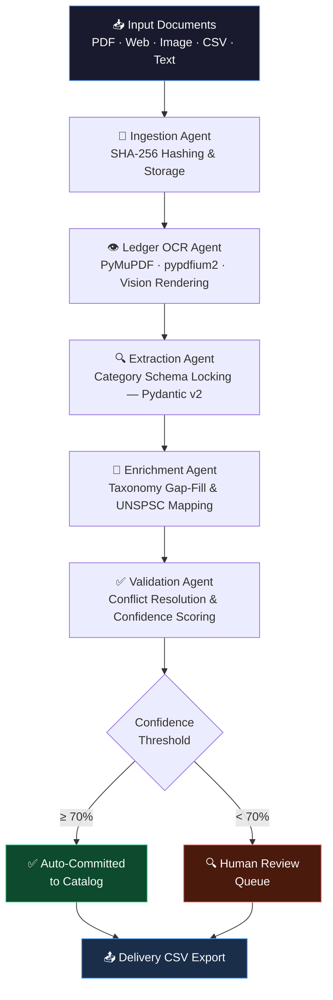
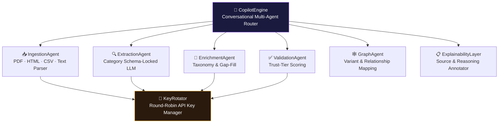
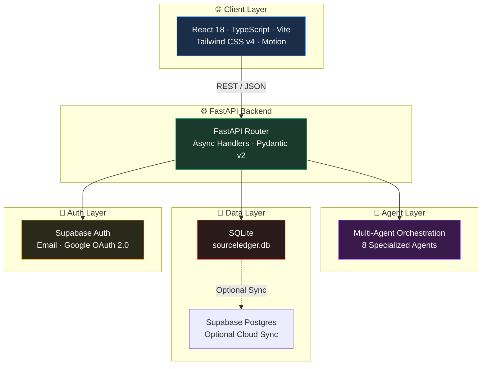

<div align="center">


<br/>

[](https://git.io/typing-svg)

<br/>

[](https://opensource.org/licenses/Apache-2.0)
[](https://www.python.org/)
[](https://fastapi.tiangolo.com)
[](https://reactjs.org/)
[](https://www.typescriptlang.org/)
[](https://supabase.com)

<br/>

[](https://unihack.net)
[](https://github.com/balaraj74)
[]()

</div>

---

<div align="center">

## ✨ What Makes SourceLedger Different?

</div>

> **The Golden Rule:** *No product attribute enters the catalog without a verifiable source citation, a 0–100% confidence score, and an explicit AI reasoning chain.*

Unlike black-box AI enrichment tools that silently hallucinate part numbers and attributes, SourceLedger provides **complete data provenance** — every field tells you *where it came from*, *how confident the AI is*, and *why that value was chosen*. Low-confidence fields are automatically routed to human reviewers, making SourceLedger the first truly **explainable** product catalog intelligence engine.

---

## 📋 Table of Contents

<div align="center">

| | Section | | Section |
|:---:|:---|:---:|:---|
| 🎯 | [What is SourceLedger?](#-what-is-sourceledger) | 🔐 | [Authentication & Security](#-authentication--security) |
| ❗ | [Problem Statement](#-problem-statement) | 💻 | [Prerequisites](#-prerequisites) |
| 💡 | [Solution Overview](#-solution-overview) | ⚡ | [Quick Start](#-quick-start) |
| 🚀 | [Key Features](#-key-features) | 🔧 | [Manual Installation](#-manual-installation) |
| ⚙️ | [How It Works](#️-how-it-works) | 🔑 | [Environment Variables](#-environment-variables) |
| 🤖 | [Multi-Agent Architecture](#-multi-agent-architecture) | 🧪 | [Testing](#-testing) |
| 🏗️ | [System Architecture](#️-system-architecture) | 🔭 | [Troubleshooting](#-troubleshooting) |
| 📁 | [Project Structure](#-project-structure) | 📊 | [Quality Metrics](#-quality-metrics) |
| 🛠️ | [Technology Stack](#️-technology-stack) | 🗺️ | [Roadmap](#️-roadmap) |
| 🌐 | [API Reference](#-api-reference) | 📜 | [License](#-license) |
| 🗄️ | [Database](#️-database) | 👥 | [Contributors](#-contributors) |

</div>

---

## 🎯 What is SourceLedger?

**SourceLedger** is an enterprise-grade AI Product Intelligence and Catalog Harmonization System built for industrial e-commerce, distributor onboarding, and catalog data engineering teams.

It ingests **multi-format documents** — PDF specification sheets, scanned catalog images, vendor web pages, raw text, and bulk CSVs — and transforms them into standardized, commerce-ready product records. Every extracted attribute is:

<div align="center">

| 🎯 Attribute | 📋 Description |
|:---:|:---|
| **📍 Source-Cited** | Verbatim text excerpt from the original document |
| **📊 Confidence-Scored** | 0–100% field-level trust score |
| **🧠 Reasoning-Chained** | Explicit AI justification for every value chosen |
| **✅ Review-Gated** | Auto-committed if ≥70%, else human review queue |

</div>

---

## ❗ Problem Statement

Industrial distributors process millions of complex technical listings from thousands of manufacturers. Today, this workflow is broken:

<div align="center">

```
┌─────────────────────────────────────────────────────────────────┐
│                    THE CATALOG DATA PROBLEM                     │
├──────────────────────┬──────────────────────────────────────────┤
│  📄 Source Chaos     │ Specs locked in PDFs, scans, HTML, CSVs  │
│  📐 Unit Anarchy     │ GPM vs m³/h, 3/8" vs 0.375", HP vs kW   │
│  👻 AI Hallucinations│ Black-box tools invent unverified facts   │
│  ⏱️ Manual Bottleneck│ 100s of hours per catalog onboarding     │
└──────────────────────┴──────────────────────────────────────────┘
```

</div>

---

## 💡 Solution Overview

SourceLedger resolves catalog chaos through a **multi-agent orchestration pipeline** pairing multimodal vision LLMs with deterministic validation rules:



---

## 🚀 Key Features

<div align="center">

| Feature | Description |
|:---:|:---|
| 📄 **Multi-Format Ingestion** | PDF spec sheets, web URLs, scanned images, raw text, bulk CSV |
| 👁️ **Ledger Multimodal OCR** | Multi-page PyMuPDF + pypdfium2 vision rendering with page-level citations |
| 🔒 **Domain Schema Locking** | 6 industrial category Pydantic schemas: pump · connector · fastener · tool · appliance · generic |
| 📊 **Confidence Scoring** | 0–100% field-level scores with 3-tier source trust ranking (OEM → Distributor → Marketplace) |
| 🧾 **Field Provenance** | Verbatim source excerpts + LLM reasoning chains for every single attribute |
| 🖊️ **Human-in-the-Loop** | Review Queue with immutable `ReviewAction` audit logging |
| 🤖 **Catalog Copilot** | Conversational multi-agent AI with live SQLite read + tool dispatch |
| 🔐 **Supabase Auth** | Email/password, email verification, password reset & Google OAuth 2.0 |
| 🧍 **Per-User Isolation** | Every record is ownership-scoped — cross-user access is architecturally impossible |
| 📤 **Delivery CSV Export** | Standardized Unihack/commerce-format export |

</div>

---

## ⚙️ How It Works

### 1️⃣ Document Ingestion & OCR

```
User uploads PDF/URL/Image
         │
         ▼
📁 Document stored with SHA-256 hash (idempotency)
         │
         ▼
📸 PDF pages rendered as high-res PNG screenshots (PyMuPDF)
         │
         ▼
🤖 Vision LLM analyzes each page concurrently
         │
         ▼
📦 Structured JSON extracted with field-level confidence
```

### 2️⃣ Extraction, Enrichment & Validation

```
Schema Locking  ──►  Gap Fill  ──►  Conflict Resolution  ──►  Status Assignment
    │                   │                   │                        │
Pydantic v2         Secondary          Tier-ranked             auto_committed
category model      sources            trust scores            OR needs_review
```

### 3️⃣ Human Review Cycle

```
🚩 needs_review field appears in Review Queue
         │
Catalog manager: Accept · Edit · Reject
         │
         ▼
ReviewAction logged immutably in audit trail
         │
         ▼
Field confidence updated — promotes to auto_committed
```

---

## 🤖 Multi-Agent Architecture



| Agent | Responsibility |
|:---:|:---|
| **📥 IngestionAgent** | Parses PDFs, HTML, text, CSV; SHA-256 hashing for idempotency |
| **🔍 ExtractionAgent** | Category-locked structured LLM extractions against Pydantic schemas |
| **🧬 EnrichmentAgent** | Secondary gap-fill, UNSPSC/eCl@ss taxonomy code mapping |
| **✅ ValidationAgent** | Weighted confidence scores, multi-source conflict resolution, review routing |
| **🕸️ GraphAgent** | Product relationships, part-number variants, cross-reference analysis |
| **📋 ExplainabilityLayer** | Verbatim source annotations and LLM reasoning chains on every field |
| **🤖 CopilotEngine** | Conversational router dispatching multi-agent tools over live data |
| **🔑 KeyRotator** | Thread-safe round-robin Gemini API key rotation to avoid rate limits |

---

## 🏗️ System Architecture



---

## 📁 Project Structure

```
SourceLedger/
│
├── 🔧 backend/
│   ├── 👁️ ocr_feature/
│   │   └── ocr_agent/
│   │       ├── agent.py               # Multimodal OCR Agent orchestrator
│   │       ├── gateway_client.py      # LLM gateway & fallback routing
│   │       ├── prompts.py             # Vision extraction prompt templates
│   │       ├── schemas.py             # OCR Pydantic models
│   │       └── tools.py               # PDF preprocessing & extractors
│   │
│   └── 🐍 src/
│       ├── 🤖 agents/
│       │   ├── enrichment_agent.py
│       │   ├── explainability_layer.py
│       │   ├── extraction_agent.py
│       │   ├── graph_agent.py
│       │   ├── ingestion_agent.py
│       │   ├── key_rotator.py         # Round-robin API key rotation
│       │   └── validation_agent.py
│       │
│       ├── 🌐 api/
│       │   ├── routes_conflicts.py
│       │   ├── routes_copilot.py
│       │   ├── routes_dashboard.py
│       │   ├── routes_export.py
│       │   ├── routes_fields.py
│       │   ├── routes_graph.py
│       │   ├── routes_ingest.py
│       │   ├── routes_ocr.py
│       │   ├── routes_products.py
│       │   └── routes_review.py
│       │
│       ├── 💾 db/
│       │   ├── store.py               # SQLite store — per-user data isolation
│       │   └── supabase_client.py
│       │
│       ├── 📐 models/
│       │   ├── product_record.py      # ProductRecord + confidence calculation
│       │   └── schemas.py             # Category schema registry (6 domains)
│       │
│       ├── 🔧 services/
│       │   ├── catalog_qa_service.py
│       │   ├── copilot_service.py
│       │   ├── csv_processor.py
│       │   ├── dashboard_service.py
│       │   └── jsonld_exporter.py
│       │
│       ├── config.py                  # Env settings via pydantic-settings (no hardcoded keys)
│       └── main.py
│
├── ⚛️ frontend/
│   └── src/
│       ├── 🧩 components/
│       │   ├── auth/                  # Full Supabase auth suite
│       │   ├── CatalogCopilotView.tsx # AI conversational interface
│       │   ├── DashboardView.tsx      # Quality metrics dashboard
│       │   ├── FieldInspectorView.tsx # Per-field provenance inspector
│       │   ├── IngestModal.tsx        # Multi-format document ingestion
│       │   ├── ProductsCatalogView.tsx
│       │   └── ReviewQueueView.tsx    # Human-in-the-loop review
│       │
│       ├── context/                   # React AuthContext provider
│       └── lib/                       # API client & Supabase SDK
│
├── 📚 docs/                            # Architecture & PRD documentation
├── 📥 input/                           # Sample input datasets
├── 📤 output/                          # Generated delivery CSV files
├── 🗂️ sample_data/                     # Category sample documents
├── 🐘 supabase/                        # Migrations & config
│
├── 🐳 docker-compose.yml
├── ▶️  start.sh                         # One-command launcher
├── 🔄 run_batch_processing.py          # CLI bulk batch processor
├── 📋 .env.example
└── 📝 CHANGELOG.md
```

---

## 🛠️ Technology Stack

<div align="center">

### Frontend

[](https://skillicons.dev)

### Backend

[](https://skillicons.dev)

### Infrastructure & Auth

[](https://skillicons.dev)

</div>

<br/>

| Layer | Technology | Purpose |
|:---:|:---|:---|
| **⚛️ Frontend** | React 18 + TypeScript | Component-based SPA with strict type safety |
| **⚡ Build** | Vite | Ultra-fast HMR dev server & production bundler |
| **🎨 Styling** | Tailwind CSS v4 + Motion | Glassmorphic design + smooth micro-animations |
| **📈 Charts** | Recharts + Lucide React | Quality metric dashboards & UI icons |
| **🔐 Auth** | Supabase Auth | Email/password & Google OAuth 2.0 |
| **🐍 Backend** | FastAPI + Uvicorn | High-performance async REST API |
| **📐 Schemas** | Pydantic v2 + Settings | Category locking & env config (no hardcoded keys) |
| **👁️ OCR** | PyMuPDF · pypdfium2 · Pillow | PDF rendering & image preprocessing |
| **💾 Database** | SQLite + Supabase Postgres | Local store + optional cloud sync |
| **🤖 AI / LLM** | Google Gemini API | Multimodal vision & structured text extraction |
| **📊 CSV** | Pandas + csv | Delivery format CSV generation |
| **🧪 Testing** | Pytest + pytest-asyncio | Backend unit & integration tests |

---

## 🌐 API Reference

**Base URL:** `http://localhost:8000/api` &nbsp;|&nbsp; **Swagger UI:** [`/docs`](http://localhost:8000/docs) &nbsp;|&nbsp; **ReDoc:** [`/redoc`](http://localhost:8000/redoc)

> All endpoints require the `x-user-id` header for per-user data isolation.

| Method | Endpoint | Description |
|:---:|:---|:---|
|  | `/api/copilot/chat` | Natural language chat with multi-agent tool execution |
|  | `/api/copilot/suggestions` | Contextual quick-start prompt suggestions |
|  | `/api/ingest` | Ingest PDF / web URL / text / CSV through the pipeline |
|  | `/api/extract` | Multimodal Vision OCR extraction |
|  | `/api/products` | List catalog products (scoped to authenticated user) |
|  | `/api/products/{id}` | Retrieve detailed product record with field provenance |
|  | `/api/fields/approve` | Approve a single field or all fields on a product |
|  | `/api/fields/edit` | Override an attribute and log a `ReviewAction` |
|  | `/api/review` | Fields flagged `needs_review` for human inspection |
|  | `/api/dashboard/stats` | Catalog quality metrics and ingestion statistics |
|  | `/api/export/csv` | Export full catalog as delivery-format CSV |

---

## 🗄️ Database

SourceLedger uses a **dual-layer persistence** strategy:

```
Primary:   SQLite (backend/sourceledger.db)  ← Zero-config, survives restarts
Optional:  Supabase Postgres               ← Cloud sync via supabase_client.py
```

### Schema

```sql
-- All tables include user_id for per-user isolation
sources        (id UUID, content_hash TEXT, user_id TEXT, data JSON)
products       (id UUID, category TEXT, name TEXT, confidence REAL, user_id TEXT, data JSON)
review_actions (id UUID, product_id UUID, user_id TEXT, data JSON)
```

---

## 🔐 Authentication & Security

<div align="center">

| 🔒 Feature | Detail |
|:---:|:---|
| **📧 Email Auth** | Sign-up, sign-in with email verification guard |
| **🔑 Google OAuth 2.0** | One-click Google single sign-on |
| **🔄 Password Reset** | Recovery email → secure new password flow |
| **🧍 User Isolation** | Every record scoped to owner — 404/403 on cross-user access |
| **🚫 No Hardcoded Keys** | All API keys read from `.env` via `pydantic-settings` |
| **#️⃣ Content Hashing** | SHA-256 document deduplication without exposing content |

</div>

---

## 💻 Prerequisites

```bash
Python  ≥ 3.10  (3.12 recommended)
Node.js ≥ 18.0  (24.x supported)
npm     ≥ 9.0
```

---

## ⚡ Quick Start

```bash
# Clone the repo
git clone https://github.com/balaraj74/SourceLedger.git
cd SourceLedger

# One-command launch — installs everything and starts both servers
chmod +x start.sh
./start.sh
```

The `start.sh` script automatically:

- ✅ Verifies Python, Node.js, npm versions
- 📦 Creates Python virtual environment and installs all dependencies
- 📦 Installs frontend Node modules
- 📋 Creates `.env` files from `.env.example` if missing
- 🚀 Launches FastAPI backend on **http://localhost:8000**
- 🚀 Launches Vite frontend on **http://localhost:3000**

---

## 🔧 Manual Installation

### Backend

```bash
cd backend
python3 -m venv .venv
source .venv/bin/activate          # Windows: .venv\Scripts\activate
pip install -r requirements.txt
cp .env.example .env
# → Fill in your API keys in backend/.env
uvicorn src.main:app --reload --port 8000
```

### Frontend

```bash
cd frontend
npm install
cp .env.example .env
# → Fill in your Supabase credentials in frontend/.env
npm run dev -- --port 3000
```

---

## 🔑 Environment Variables

### Backend (`backend/.env`)

| Variable | Required | Default | Purpose |
|:---|:---:|:---:|:---|
| `API_URL` | ✅ Yes | — | LLM Gateway proxy URL |
| `API_KEY` | ✅ Yes | — | Gateway proxy authentication key |
| `GOOGLE_API_KEY1` … `8` | ⚪ Optional | `""` | Gemini keys for round-robin rotation |
| `CONFIDENCE_THRESHOLD` | ⚪ Optional | `70` | Auto-commit threshold (0–100) |
| `SOURCE_STORAGE_PATH` | ⚪ Optional | `./storage/sources` | Ingested document storage path |
| `SUPABASE_URL` | ⚪ Optional | `""` | Supabase project URL |
| `SUPABASE_KEY` | ⚪ Optional | `""` | Supabase service API key |

### Frontend (`frontend/.env`)

| Variable | Required | Purpose |
|:---|:---:|:---|
| `VITE_SUPABASE_URL` | ✅ Yes | Supabase project URL for auth |
| `VITE_SUPABASE_ANON_KEY` | ✅ Yes | Supabase public anon key |

---

## 🧪 Testing

```bash
# Backend — all unit & integration tests
python3 -m pytest backend/tests -v

# OCR Agent — vision pipeline tests
python3 -m pytest backend/ocr_feature/tests -v

# Frontend — TypeScript type checking & lint
cd frontend && npm run lint
```

---

## 🔭 Troubleshooting

| 🔴 Issue | ✅ Fix |
|:---|:---|
| **500 OCR Agent Error** | Run `pip install pillow pymupdf pypdfium2 jinja2` inside `backend/.venv` |
| **CORS / Connection Refused** | Confirm FastAPI is running: `curl http://localhost:8000/docs` |
| **Supabase Auth Redirect Loop** | Add `http://localhost:3000` to **Site URL** in Supabase Dashboard → Auth → URL Configuration |
| **0% Confidence on All Fields** | Unknown category falls back to `generic` schema. Check product category detection. |
| **HTTP 429 Rate Limit** | Add more Gemini keys (`GOOGLE_API_KEY2`, etc.) for round-robin rotation |

---

## 📊 Quality Metrics

<div align="center">

| Metric | Result |
|:---:|:---:|
| ⚡ Pipeline Velocity | < 3 seconds per item (parallel vision concurrency) |
| 📐 Schema Compliance | 100% — 6 Pydantic domain models validated |
| 📍 Output Provenance | Every field has verbatim quote + confidence + reasoning |
| 🧍 Data Isolation | Smoke-tested — cross-user access returns `None` at store layer |

</div>

---

## 🗺️ Roadmap

- [ ] 🔍 **Vector Similarity Deduplication** — Qdrant embeddings to cluster duplicate supplier listings
- [ ] 🏷️ **Automated UNSPSC/eCl@ss Taxonomy** — Expand industrial code lookups
- [ ] 🔄 **Active Learning Loop** — Feed `ReviewAction` corrections back into prompt refinement
- [ ] ☁️ **Multi-Tenant Cloud Deploy** — Cloud Run + Supabase Row Level Security
- [ ] 📱 **Mobile Catalog Reviewer** — React Native companion app for review queue

---

## 📜 License

<div align="center">

[](https://opensource.org/licenses/Apache-2.0)

SourceLedger is open-source software licensed under the **Apache License, Version 2.0**.

</div>

```
Copyright 2026 SourceLedger Contributors

Licensed under the Apache License, Version 2.0 (the "License");
you may not use this file except in compliance with the License.
You may obtain a copy of the License at http://www.apache.org/licenses/LICENSE-2.0

Unless required by applicable law or agreed to in writing, software
distributed under the License is distributed on an "AS IS" BASIS,
WITHOUT WARRANTIES OR CONDITIONS OF ANY KIND, either express or implied.
```

---

## 👥 Contributors

<div align="center">

| 🧑‍💻 Contributor | 🎯 Role |
|:---:|:---:|
| **Balaraj R** | Founder & Lead Engineer |
| **Bharath CD** | Co-founder |

</div>

---

<div align="center">


*Built with ❤️ for UniHack 2026 — Team ERROR_404_NOT_FOUND*

</div>