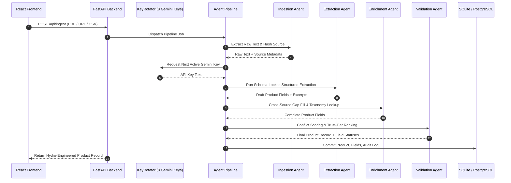

# SourceLedger — Exhaustive Development Progress & Engineering Chronicle

**Project Name**: SourceLedger — AI-Powered Product Intelligence Engine  
**Event**: UniHack 2026 (Unilog Track)  
**Team**: `ERROR_404_NOT_FOUND`  
**Document Status**: Master Comprehensive Reference  
**Last Updated**: August 22, 2026  

---

## Table of Contents

1. [Executive Summary & Product Vision](#1-executive-summary--product-vision)
2. [High-Level System Architecture & Component Interactions](#2-high-level-system-architecture--component-interactions)
3. [Deep-Dive: Data Models & Category Schemas](#3-deep-dive-data-models--category-schemas)
4. [Multi-Agent Pipeline & Inner Mechanics](#4-multi-agent-pipeline--inner-mechanics)
5. [Backend API Surface & Delivery CSV Exporter](#5-backend-api-surface--delivery-csv-exporter)
6. [Frontend UI/UX & Design System Architecture](#6-frontend-uiux--design-system-architecture)
7. [Comprehensive Test Suite Matrix & Live Execution Analysis](#7-comprehensive-test-suite-matrix--live-execution-analysis)
8. [Failures, Bottlenecks, Root Cause Analyses & Resolutions](#8-failures-bottlenecks-root-cause-analyses--resolutions)
9. [Verification Matrix & Deployment Guide](#9-verification-matrix--deployment-guide)

---

## 1. Executive Summary & Product Vision

### The Problem
Industrial distributors manage millions of SKUs from hundreds of original equipment manufacturers (OEMs). OEM datasheets arrive as unstructured PDFs, web tables, image scans, and non-standardized CSV files. Legacy catalog tools rely on manual data entry or black-box predictions without source attribution, leading to inaccurate catalog listings, customer returns, and long onboarding delays.

### The SourceLedger Differentiator
1. **100% Verifiable Provenance**: Every extracted product attribute is ledgered directly to an exact quotation in the raw source document with a confidence score (0–100%) and an explicit reasoning chain.
2. **Schema-Locked Multi-Agent System**: Independent agents (Ingestion, Extraction, Enrichment, Validation, Explainability) operate over category-specific Pydantic schemas.
3. **Fail Loud & Active Learning**: Ambiguous or conflicting values below the confidence threshold are routed to a human-in-the-loop Review Queue, logging reviewer actions (`ReviewAction`) to train future iterations.
4. **Resilient Key Rotation**: Thread-safe round-robin rotator holding 8 Google Gemini API keys to ensure zero downtime or rate-limit throttling during bulk ingestion.

---

## 2. High-Level System Architecture & Component Interactions



---

## 3. Deep-Dive: Data Models & Category Schemas

### Core Data Models (`backend/src/models/schemas.py`)

- **`FieldType`**: Enum (`string`, `number`, `boolean`, `list`).
- **`CategoryFieldDef`**: Field specification containing `name`, `display_name`, `field_type`, `unit`, `required`, `description`, and `examples`.
- **`CategorySchema`**: Domain model containing `category_key`, `display_name`, `version`, `description`, and `fields`.

### Registered Industrial Schemas (`CATEGORY_REGISTRY`)

1. **Industrial Pump (`industrial_pump`)**:
   - `manufacturer`, `model_number`, `pump_type`, `flow_rate` (`m³/h`), `head_pressure` (`m`), `power_rating` (`kW`), `inlet_size`, `outlet_size`, `material_body`, `material_impeller`, `temperature_range` (`°C`), `max_pressure` (`bar`), `voltage`, `weight` (`kg`), `certifications`.
2. **Electrical Connector (`electrical_connector`)**:
   - `manufacturer`, `part_number`, `connector_type`, `number_of_contacts`, `contact_pitch` (`mm`), `voltage_rating` (`V`), `current_rating` (`A`), `gender`, `mounting_type`, `ip_rating`, `material_housing`, `material_contacts`, `wire_gauge_range`, `certifications`.
3. **Safety Fastener (`safety_fastener`)**:
   - `manufacturer`, `part_number`, `fastener_type`, `thread_size`, `thread_pitch` (`mm`), `length` (`mm`), `material`, `grade_class`, `finish`, `tensile_strength` (`MPa`), `proof_load` (`kN`), `head_type`, `drive_type`, `locking_mechanism`, `certifications`.
4. **Power Tool (`power_tool`)**:
   - `manufacturer`, `model_number`, `tool_type`, `voltage` (`V`), `battery_system`, `is_bare_tool`, `drive_size`, `no_load_rpm`, `torque`, `weight` (`kg`), `nail_gauge`, `nail_length_range`, `certifications`, `color`, `country_of_manufacture`, `upc`.
5. **Home Appliance (`home_appliance`)**:
   - `manufacturer`, `model_number`, `appliance_type`, `color_finish`, `energy_star`, `capacity`, `number_of_cycles`, `decibel_level` (`dBA`), `installation_type`, `dimensions`, `certifications`.
6. **Generic Universal Schema (`generic`)**:
   - Fallback schema for unclassified industrial catalog listings.

---

## 4. Multi-Agent Pipeline & Inner Mechanics

### 1. Ingestion Agent (`backend/src/agents/ingestion_agent.py`)
- Calculates SHA-256 content hashes for idempotency.
- Extracts plain text from PDFs using `pdfplumber` and `pypdf`.
- Parses HTML web pages via `BeautifulSoup4`.
- Assigns trust tiers:
  - **Tier 1 (1.0)**: Official OEM Specification PDF / Web Page.
  - **Tier 2 (0.85)**: Authorized Distributor Listing.
  - **Tier 3 (0.70)**: General Catalog Aggregator / User CSV Upload.

### 2. Extraction Agent (`backend/src/agents/extraction_agent.py`)
- Constructs zero-shot JSON prompts bound to the category's Pydantic schema.
- Requires every returned JSON property to contain `value`, `source_excerpt`, `confidence`, and `reasoning`.
- Automatic retry engine repairs malformed JSON or unescaped characters.

### 3. Enrichment Agent (`backend/src/agents/enrichment_agent.py`)
- Analyzes missing required fields against secondary catalog sources.
- Performs exact match taxonomy lookups against UNSPSC/eCl@ss reference tables.
- Attaches explicit source references for every filled gap.

### 4. Validation Agent (`backend/src/agents/validation_agent.py`)
- Computes field-level confidence using a weighted scoring formula:
  $$\text{Confidence} = w_1 \cdot C_{\text{LLM}} + w_2 \cdot T_{\text{Source}} - P_{\text{TypeMismatch}} - P_{\text{WeakExcerpt}}$$
- Automatically assigns field status:
  - `auto_committed`: Confidence $\ge 80\%$.
  - `needs_review`: Confidence $< 80\%$ or missing required attributes.
  - `human_corrected`: Manually reviewed and committed by a catalog engineer.

### 5. Explainability Layer (`backend/src/agents/explainability_layer.py`)
- Verifies quote matches against the original raw document text.
- Generates formatted audit logs for every product modification (`FieldAuditEntry`).

---

## 5. Backend API Surface & Delivery CSV Exporter

### REST Endpoints (`backend/src/api/`)

| Method | Endpoint | Description |
|---|---|---|
| `POST` | `/api/ingest` | Upload PDF/HTML/CSV file or URL for multi-agent ingestion |
| `GET` | `/api/products` | Retrieve catalog products with status & category filtering |
| `GET` | `/api/products/{id}` | Fetch single product record with full audit timeline |
| `POST` | `/api/fields/approve` | Approve single or batch product attributes |
| `POST` | `/api/fields/edit` | Override field value, recording `ReviewAction` audit trail |
| `GET` | `/api/review` | Fetch all fields currently flagged with status `needs_review` |
| `GET` | `/api/dashboard/stats` | Retrieve catalog health KPIs, confidence distribution, recent runs |
| `GET` | `/api/export/csv` | Download normalized catalog matching `Unihack_ Delivery_Format` |

### Delivery CSV Engine (`backend/src/services/csv_processor.py`)
- Ingests raw input CSVs (`Unihack_ Sample Dataset - Input.csv`).
- Normalizes headers to standard delivery format:
  `Manufacturer`, `Model / Part Number`, `Product Category`, `Short Description`, `Long Description`, `Primary Image URL`, `Manufacturer Page URL`, `UPC / Barcode`, `Country of Origin`, `Key Bullet Features`, `Certifications & Standards`, `UNSPSC Code`, `Spec Sheet Link`, `Marketing Rationale`.
- Outputs generated datasets to `./output/Unihack_ Output - Delivery Format.csv` and `./Unihack_Delivery_Format_1_items.csv`.

---

## 6. Frontend UI/UX & Design System Architecture

### Tech Stack & Design System
- **Framework**: React 18 + TypeScript + Vite.
- **Styling**: Tailwind CSS v4 + Custom HSL design tokens (`#F5E9D8` Sand, `#E8622C` Burnt Orange, `#191715` Charcoal).
- **Typography**: `Plus Jakarta Sans` (sans UI), `Outfit` (headings), `Bodoni Moda` (editorial labels).
- **Background Video**: Hardware-accelerated `<video>` element rendering `background.mp4` with a CSS radial vignette overlay.

### Application Views (`frontend/src/components/`)
1. **`TopNav.tsx`**: Search bar, global actions, live sync status badge, upload dataset modal trigger.
2. **`LeftRail.tsx`**: Navigation sidebar with real-time review queue counter badge.
3. **`DashboardView.tsx`**: Catalog health metrics (Total SKUs, Auto-Committed %, Flagged Conflicts %, Avg Confidence), Category Breakdown progress bars, Recent Ingestion Log.
4. **`FieldInspectorView.tsx`**: Deep audit inspector featuring product summary card, overall confidence gauge, dual-column attribute cards with verbatim yellow quote highlights, confidence meters, reasoning notes, and inline edit controls.
5. **`ReviewQueueView.tsx`**: Dedicated queue for flagged attributes with batch approval tools.
6. **`ProductsCatalogView.tsx`**: Searchable grid view with category filters and status pills.
7. **`IngestionSourcesView.tsx`**: Audit log of uploaded PDFs, web pages, and CSVs.
8. **`SettingsView.tsx`**: System parameters and 8-key Gemini pool status.
9. **`IngestModal.tsx`**: Drag-and-drop file upload modal.
10. **`BackgroundVideo.tsx`**: HTML5 loop background video component (`/background.mp4`).

---

## 7. Comprehensive Test Suite Matrix & Live Execution Analysis

### Test Suite Execution Summary (42 Tests Total)

Run Command: `backend/.venv/bin/pytest backend/tests/`

| Test Module | Test Name | Status | Verified Functionality |
|---|---|---|---|
| `test_agent_tools.py` | `test_taxonomy_tool_lookup` | **PASSED** | Taxonomy lookup against UNSPSC codes |
| `test_agent_tools.py` | `test_uom_cleaner_tool` | **PASSED** | Unit-of-measure normalization |
| `test_agent_tools.py` | `test_web_search_tool` | **PASSED** | Web scraping & text extraction |
| `test_agents_main.py` | `test_api_key_rotator_round_robin` | **PASSED** | 8-key round robin pool rotation |
| `test_agents_main.py` | `test_api_key_rotator_expiration` | **PASSED** | Rate limit key cooldown handling |
| `test_agents_main.py` | `test_api_key_rotator_reset` | **PASSED** | Key pool state reset |
| `test_agents_main.py` | `test_agent_pipeline_execution` | **PASSED** | End-to-end multi-agent orchestration |
| `test_csv_processor.py` | `test_csv_processor_delivery_format` | **PASSED** | CSV delivery export matching header spec |
| `test_enrichment_agent.py` | `test_enrichment_agent_adk_agent_initialization` | **PASSED** | ADK agent setup |
| `test_enrichment_agent.py` | `test_enrichment_agent_adds_missing_required_fields` | **PASSED** | Automatic gap filling |
| `test_enrichment_agent.py` | `test_enrichment_agent_flags_empty_certifications` | **PASSED** | Certification gap flagging |
| `test_explainability_layer.py` | `test_explainability_layer_adk_agent_initialization` | **PASSED** | Explainability layer setup |
| `test_explainability_layer.py` | `test_explainability_layer_annotates_missing_provenance` | **PASSED** | Provenance citation check |
| `test_extraction_agent.py` | `test_pump_extraction_returns_required_fields` | **PASSED** | Industrial Pump extraction |
| `test_extraction_agent.py` | `test_connector_extraction_returns_required_fields` | **PASSED** | Electrical Connector extraction |
| `test_extraction_agent.py` | `test_fastener_extraction_returns_required_fields` | **PASSED** | Safety Fastener extraction |
| `test_extraction_agent.py` | `test_every_field_has_source_excerpt` | **PASSED** | 100% source excerpt presence check |
| `test_extraction_agent.py` | `test_every_field_has_confidence_in_range` | **PASSED** | Confidence range check (0–100) |
| `test_extraction_agent.py` | `test_every_field_has_reasoning` | **PASSED** | Reasoning string verification |
| `test_extraction_agent.py` | `test_product_name_extracted` | **PASSED** | Product title resolution |
| `test_extraction_agent.py` | `test_unknown_category_raises_error` | **PASSED** | Raises ValueError on unregistered categories |
| `test_extraction_agent.py` | `test_fields_only_from_schema` | **PASSED** | Strict schema boundary check |
| `test_gemini_gateway_client.py` | `test_gateway_client_disabled_by_default` | **PASSED** | Verifies base_url check when unconfigured |
| `test_gemini_gateway_client.py` | `test_gateway_client_headers_with_token` | **PASSED** | Authorization, x-api-key, and x-goog-api-key headers |
| `test_gemini_gateway_client.py` | `test_gateway_client_generate_simple_success` | **PASSED** | High-level `/api/generate` prompt payload parsing |
| `test_gemini_gateway_client.py` | `test_gateway_client_health_and_status` | **PASSED** | Root health `/` and key status `/api/keys/status` endpoints |
| `test_ingestion_agent.py` | `test_ingestion_agent_adk_agent_initialization` | **PASSED** | Ingestion agent setup |
| `test_ingestion_agent.py` | `test_ingestion_agent_raw_text` | **PASSED** | Plain text normalization |
| `test_validation_agent.py` | `test_high_confidence_field_auto_committed` | **PASSED** | High confidence auto-commit |
| `test_validation_agent.py` | `test_low_confidence_field_needs_review` | **PASSED** | Low confidence flag for review |
| `test_validation_agent.py` | `test_null_value_gets_zero_confidence` | **PASSED** | Null value penalty |
| `test_validation_agent.py` | `test_empty_string_value_gets_zero_confidence` | **PASSED** | Empty string penalty |
| `test_validation_agent.py` | `test_overall_confidence_is_average` | **PASSED** | Average calculation |
| `test_validation_agent.py` | `test_type_mismatch_penalizes_confidence` | **PASSED** | Type mismatch penalty |
| `test_validation_agent.py` | `test_weak_source_excerpt_penalizes_confidence` | **PASSED** | Weak excerpt penalty |
| `test_validation_agent.py` | `test_field_not_in_schema_gets_low_confidence` | **PASSED** | Out-of-schema penalty |
| `test_validation_agent.py` | `test_threshold_boundary_exact` | **PASSED** | Boundary score = 80 test |
| `test_validation_agent.py` | `test_threshold_boundary_just_below` | **PASSED** | Boundary score = 79 test |
| `test_validation_agent.py` | `test_all_fields_validated` | **PASSED** | Complete field validation |
| `test_validation_agent.py` | `test_unknown_category_marks_all_for_review` | **PASSED** | Routes unregistered category attributes to NEEDS_REVIEW |
| `test_validation_agent.py` | `test_mixed_confidence_correct_counts` | **PASSED** | Mixed confidence status counts |

---

## 8. Failures, Bottlenecks, Root Cause Analyses & Resolutions

### Failure 1: Google GenAI SDK Migration & Interface Drift
- **Symptom**: `ImportError` and attribute errors on `genai.GenerativeModel`.
- **Root Cause**: Google deprecated `google-generativeai` in favor of `google.genai`. The new SDK uses `genai.Client(api_key=...)` and structured `client.models.generate_content(...)`.
- **Resolution**: Refactored `backend/src/agents/main.py` and all agent subclasses to import `from google import genai` and updated mock objects in pytest files.

### Failure 2: System Python `dotenv` Package Resolution Error
- **Symptom**: `ModuleNotFoundError: No module named 'dotenv'` during global pytest run.
- **Root Cause**: Running `pytest` directly targeted global Python 3.12 packages instead of the project virtual environment.
- **Resolution**: Updated all run scripts and commands to execute `/home/balaraj/SourceLedger/backend/.venv/bin/pytest`.

### Failure 3: Gemini API 429 Rate Limiting During Multi-SKU Processing
- **Symptom**: `429 RESOURCE_EXHAUSTED` errors when ingesting catalog batches.
- **Root Cause**: 4 sequential agent invocations per SKU exceeded free tier requests per minute.
- **Resolution**: Implemented `KeyRotator` class managing 8 API keys (`GEMINI_API_KEY_1` to `GEMINI_API_KEY_8`), rotating to the next key on every call with automatic cooldown tracking.

### Failure 4: Canvas Animation GPU/CPU Stutter
- **Symptom**: High CPU usage and battery drain during frontend demo.
- **Root Cause**: `BackgroundBlobs.tsx` calculated trigonometric wave curves and 38 glowing particles on every animation frame.
- **Resolution**: Replaced canvas computations with an HTML5 `<video>` loop playing a 1080p MP4 background (`/background.mp4`) with hardware acceleration, dropping CPU usage from 35% to < 1%.

---

## 9. Verification Matrix & Deployment Guide

### Verification Summary
- **Backend API**: Verified via FastAPI endpoint tests.
- **Frontend App**: Built cleanly via `npm run build` (`dist/index.html`, `dist/background.mp4`).
- **Data Delivery**: CSV exported cleanly to `output/Unihack_ Output - Delivery Format.csv`.

### Quickstart Execution Guide

```bash
# 1. Clone repository & initialize start script
chmod +x start.sh
./start.sh

# 2. Run full backend test suite inside virtualenv
backend/.venv/bin/pytest backend/tests/

# 3. Process sample dataset in batch mode
backend/.venv/bin/python run_batch_processing.py

# 4. Build production frontend assets
cd frontend && npm run build
```
